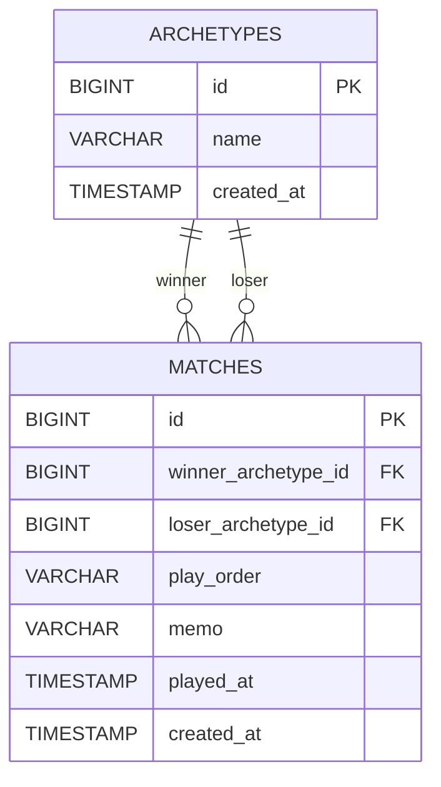

# Duel Matrix DB 設計書

このドキュメントは，Duel Matrix のデータベース設計をまとめたものです．
テーブルは **archetypes** と **matches** の 2 つのみの最小構成です．
SQL 本体は [assets/schema.sql](assets/schema.sql) と [assets/data.sql](assets/data.sql) にあります．

---

## 1. ER 図

Mermaid のソースは [assets/er_diagram.mmd](assets/er_diagram.mmd) にあります．

本アプリは**勝者記録モデル**を採用します．すなわち「勝った試合」だけを 1 件登録し，
`matches` は `archetypes` を **2 本の外部キー**（勝者側・敗者側）で参照します．
1 試合を勝者視点で 1 レコードにすることで，両者の視点による二重登録を防ぎます．
敗北・引き分けは登録しないため，`result` 列は持ちません．

---

## 2. テーブルの目的

| テーブル | 目的 |
| --- | --- |
| archetypes | アーキタイプ（デッキの種類）のマスタ．名前を一意に管理する． |
| matches | 勝った試合の記録．どのアーキタイプ（勝者）がどのアーキタイプ（敗者）に勝ったかを保存する． |

勝率マトリクスは，これら 2 テーブルを集計して**計算で求める**ため，
専用の集計テーブルは持ちません（データの二重管理を避け，整合性を保ちやすくするため）．

---

## 3. カラム定義

### 3.1 archetypes

| カラム | 型 | 制約 | 意味 |
| --- | --- | --- | --- |
| id | BIGINT | PK, 自動採番 | アーキタイプの一意な識別子 |
| name | VARCHAR(100) | NOT NULL, UNIQUE | アーキタイプ名（例: 青白ウィリデ） |
| created_at | TIMESTAMP | NOT NULL, 既定 CURRENT_TIMESTAMP | 登録日時 |

### 3.2 matches

| カラム | 型 | 制約 | 意味 |
| --- | --- | --- | --- |
| id | BIGINT | PK, 自動採番 | 対戦記録の一意な識別子 |
| winner_archetype_id | BIGINT | NOT NULL, FK→archetypes(id) | 勝者のアーキタイプ |
| loser_archetype_id | BIGINT | NOT NULL, FK→archetypes(id) | 敗者のアーキタイプ |
| play_order | VARCHAR(10) | NOT NULL, 既定 'UNKNOWN' | 勝者の先攻後攻（FIRST / SECOND / UNKNOWN） |
| memo | VARCHAR(500) | NULL 可 | 自由記述メモ |
| played_at | TIMESTAMP | NOT NULL | 対戦日時 |
| created_at | TIMESTAMP | NOT NULL, 既定 CURRENT_TIMESTAMP | 登録日時 |

> `play_order` は DB 上は文字列ですが，Java 側では enum（`PlayOrder`）として扱います．
> enum の詳細は [CLASS_DESIGN.md](CLASS_DESIGN.md) を参照してください．
> 勝った試合のみ登録するため勝敗を表す `result` 列は持ちません（旧設計から変更）．

---

## 4. 主キー・外部キー・インデックスの理由

| 種類 | 対象 | 理由 |
| --- | --- | --- |
| 主キー | archetypes.id / matches.id | 各行を一意に識別し，参照・更新を安全に行うため． |
| 外部キー | matches.winner_archetype_id → archetypes.id | 存在しないアーキタイプの対戦記録が作られないよう整合性を守るため． |
| 外部キー | matches.loser_archetype_id → archetypes.id | 同上（敗者側）． |
| 一意制約 | archetypes.name | 同名アーキタイプの重複登録を DB レベルで防ぐため． |
| インデックス | idx_matches_played_at | 履歴を日時の新しい順に取り出す処理を速くするため． |
| インデックス | idx_matches_pair(winner, loser) | マトリクス計算で「勝者×敗者」の組み合わせ集計を速くするため． |

---

## 5. この最小設計で十分な理由

- 今回の機能はアーキタイプ管理と対戦記録の集計だけなので，2 テーブルで表現できます．
- 勝率は集計で求められるため，集計結果を保存するテーブルは不要です．
- ユーザー・認証・複数 TCG などは今回のスコープ外なので，関連テーブルを持ちません．
- カラムを増やしすぎないことで，Entity・DTO・API がシンプルになり，
  4 人での分担実装が容易になります．

---

## 6. 将来 PostgreSQL に移行しやすくする配慮

| 配慮点 | 内容 |
| --- | --- |
| 標準的な型のみ使用 | BIGINT / VARCHAR / TIMESTAMP など，PostgreSQL でもそのまま使える型に限定． |
| 自動採番 | `GENERATED BY DEFAULT AS IDENTITY` は H2・PostgreSQL 双方でサポートされる書き方． |
| DB 固有機能を使わない | H2 独自の関数やストアド機能に依存しない． |
| enum は文字列で保存 | DB 依存の enum 型を使わず VARCHAR に保存し，移行時の互換性を確保． |
| 集計はアプリ側 | 勝率計算をアプリ（Java）側に置くことで，DB を差し替えても計算ロジックを流用できる． |

将来 PostgreSQL へ移すときは，`schema.sql` をほぼそのまま流用し，接続設定
（`application.properties` の datasource）を差し替えるだけで済むことを目標にしています．

---

## 7. 関連ファイル

| ファイル | 内容 |
| --- | --- |
| [assets/schema.sql](assets/schema.sql) | テーブル定義（H2 用） |
| [assets/data.sql](assets/data.sql) | 初期データ |
| [assets/er_diagram.mmd](assets/er_diagram.mmd) | ER 図（Mermaid） |
