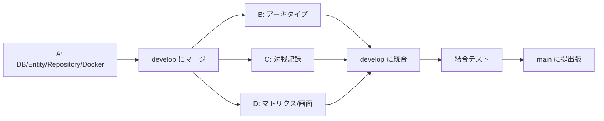

# Duel Matrix 開発ガイド（Git 運用・開発順序）

このドキュメントは，4 人で非同期にチーム開発を進めるための Git 運用と開発順序をまとめたものです．
直接集まって話せなくても，このルールに従えば衝突を最小限にして開発できます．

---

## 1. Git 運用の基本方針

1. 作業は必ず **Issue** を作成してから始める．
2. Issue 番号を使ってブランチを切る．
3. 作業完了後，**Pull Request / Merge Request** を作成する．
4. 担当者は Pull Request / Merge Request の URL を代表者に送る．
5. 代表者が内容を確認して `develop` にマージする．
6. `main` には直接 push しない．

> GitHub では **Pull Request**，GitLab では **Merge Request** と呼びます．
> どちらのサービスを使っても運用は同じです．本書では併記します．

---

## 2. ブランチ戦略

| ブランチ | 用途 |
| --- | --- |
| `main` | 提出用の安定版．直接 push 禁止． |
| `develop` | 統合用ブランチ．各担当の完成分をここへマージする． |
| `feature/*` | 各 Issue の機能開発ブランチ． |
| `docs/*` | 仕様書修正用ブランチ． |
| `fix/*` | バグ修正用ブランチ． |

```
main ← develop ← feature/12-match-api
                ← feature/13-archetype-api
                ← docs/15-update-api-spec
```

---

## 3. ブランチ名ルール

`#` は使わず，Issue 番号を数字で入れます．

```
feature/{issue-number}-{short-description}
docs/{issue-number}-{short-description}
fix/{issue-number}-{short-description}
```

例:

```
feature/12-match-api
feature/13-archetype-api
feature/14-matrix-service
docs/15-update-api-spec
fix/16-match-validation
```

---

## 4. Pull Request / Merge Request のルール

PR / MR には以下を必ず書きます．

- 対応した Issue 番号
- 実装内容
- 動作確認方法
- スクリーンショットまたは API レスポンス例
- 確認してほしい点

### テンプレート

```markdown
## 対応Issue
close #12

## 実装内容
- POST /api/matches を実装
- MatchService#createMatch を実装
- 存在しないアーキタイプIDのエラー処理を追加

## 動作確認
- docker compose up --build
- POST /api/matches を実行
- GET /api/matches で登録結果を確認

## 確認してほしい点
- DTOのフィールド名
- エラー処理
```

`close #12` と書くと，マージ時に対応する Issue が自動的にクローズされます（GitHub / GitLab 共通）．

---

## 5. コミットメッセージルール

形式:

```
<prefix>: <what changed>
```

| プレフィックス | 意味 |
| --- | --- |
| feat | 新機能追加 |
| fix | バグ修正 |
| docs | ドキュメント修正 |
| style | フォーマット修正（振る舞いは変えない） |
| refactor | 振る舞いを変えないリファクタリング |
| test | テスト追加・修正 |
| chore | 設定ファイルやビルド関連の修正 |

例:

```
feat: add match creation api
feat: implement matrix calculation service
fix: handle missing archetype id
docs: update api specification
refactor: move matrix building logic to template class
chore: add docker compose setup
```

このルールに従うと，`git log` を眺めるだけで「誰が何をしたか」が読み取りやすくなり，
各メンバーの貢献も履歴上で明確になります．

---

## 6. 開発順序

1. **A 担当**が DB・Entity・Repository・Docker 環境を先に作る．
2. A 担当の作業を `develop` にマージする．
3. **B・C・D 担当**がそれぞれ Issue を作り，`feature` ブランチで並行開発する．
4. 各担当者は Pull Request / Merge Request の URL を代表者に送る．
5. 代表者が確認して `develop` にマージする．
6. 全員で結合テストを行う．
7. `main` に提出用バージョンをマージする．



**なぜ A を先にやるのか**: Entity・Repository・コマンド基盤（`Command<T>` / `CommandInvoker`）は
B・C・D すべてが使う土台です．これが無いと他の 3 人が動けないため，最初に固めて共有します．

**B・C・D は互いに依存しない**: A さえ揃えば，B・C・D は**完全に並行**して開発できます．
担当間の結合を A だけに集約するため，以下を徹底します．

- C のアーキタイプ存在確認は，B の `ArchetypeService` ではなく A の `ArchetypeRepository` を使う．
- D のマトリクス計算は，B・C の API ではなく A の Repository から直接データを取得する．
- D の画面が呼ぶ B・C の API は，[API_SPEC.md](API_SPEC.md) で固定した「契約」への依存であり，
  コードの完成待ちにはならない（結合テストのときだけ実 API を叩いて確認する）．

この方針により，「誰かの実装が終わらないと自分が進められない」という並行開発のボトルネックを
なくしています．

---

## 7. 非同期チーム開発の注意点

直接話せない前提なので，以下を守ることで「認識のズレ」を防ぎます．

- **API 仕様を勝手に変えない**（変えるときは先に [API_SPEC.md](API_SPEC.md) を更新）．
- **DTO 名や JSON フィールド名を勝手に変えない**（他担当のコードが壊れる）．
- **DB カラム名を途中で変えない**（Entity・SQL・全担当に波及する）．
- 仕様を変更したら，コードより先に `docs` を更新し，代表者に共有する．
- PR / MR の説明は必ず丁寧に書く（レビュアーが実装を追わなくても分かるように）．
- 迷ったら「仕様書に書いてある通り」を優先する．独自解釈で進めない．

---

## 8. 担当と主な Issue の例

| 担当 | 想定 Issue 例 | ブランチ例 |
| --- | --- | --- |
| A | DB・Entity・Repository・Docker 構築 | `feature/10-base-setup` |
| B | アーキタイプ API 実装 | `feature/13-archetype-api` |
| C | 対戦記録 API 実装 | `feature/12-match-api` |
| D | マトリクス計算・画面実装 | `feature/14-matrix-service` |

各担当の詳細な作業内容・完成条件は，`docs/TASK_A_REPOSITORY.md`〜`docs/TASK_D_MATRIX_UI.md`
を参照してください．
